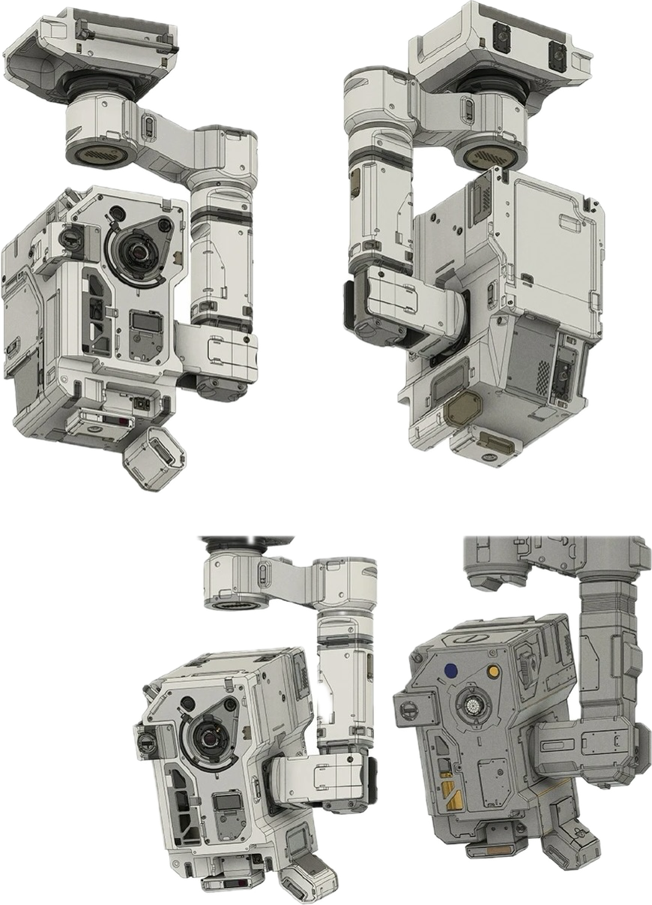

# MOSS Desk Pet

<p align="center">
  
  
</p>

MOSS Desk Pet 是一款以《流浪地球》MOSS 为灵感制作的独立桌面宠物，支持 macOS 与 Windows。它会读取本机 Codex 生成的任务生命周期记录，在 Codex Desktop 或 VS Code Codex 扩展执行任务时显示工作状态，并在任务完成、异常中断或取消时给出对应反馈。

桌宠本身是独立应用，不要求 Codex Desktop 一直开启。只要 Codex Desktop 或 VS Code Codex 扩展中的任意一个正在执行任务，并写入同一份本地 Codex 会话目录，MOSS 就可以监听状态。

无需单独填写 OpenAI API Key。额度功能复用 Codex 当前登录状态，通过 Codex 官方本地 App Server 查询，不读取 `auth.json`，也不保存访问令牌。

## 交付目录

```text
MOSS-Desk-Pet/
├── releases/
│   ├── macOS/             # Apple Silicon 与 Intel 安装包
│   └── Windows/           # Tauri 安装版与 Electron 便携版
├── source/
│   ├── moss-standalone-app/          # 可直接继续开发的完整源码
│   └── MOSS-Desk-Pet-source-v1.3.6.zip
├── docs/                  # 设定图、动画预览、首次运行和构建信息
├── README.md              # 总体介绍、安装与使用说明
├── LICENSE
└── SHA256SUMS.txt         # 发布文件校验值
```

## 主要功能

- 同时监听 Codex Desktop 与 VS Code Codex 扩展的任务状态。
- 区分任务运行、正常完成、网络等异常中断和用户取消。
- 支持同时查看多个正在运行的任务，并可随时展开或收起详情。
- 查看当前 Codex 套餐、多个额度窗口的剩余比例与下次重置时间。
- 显示近七天 Token 使用条形图；官方数据不可用时会明确标注为本地估算。
- 提供暗黑、明亮两套皮肤，以及红、琥珀、绿、青、蓝、紫等镜头颜色。
- 镜头具有发光效果，颜色资源彼此独立，方便后续增加升级色。
- 支持五档显示大小、始终置顶、系统通知、状态灯和登录时启动。
- macOS 可显示在独立全屏 Space 及全屏视频上方。
- Windows 提供低内存取向的 Tauri 安装版和 Electron 便携版。
- 托盘图标支持明暗背景适配；Windows 还可以手动指定图标颜色。

## 视觉设定

MOSS 通过右侧悬臂固定，主机本体保持悬挂状态。动画以主机抬头、低头、左右观察和轻微旋转为主，不把底部结构展开成脚，也不使用蹦跳式移动。

<p align="center">
  
  
</p>

桌宠运行素材保持统一的 Codex 原生桌宠视觉风格，并同时提供浅色、深色两套完整资源。

## 支持平台

| 平台 | 推荐版本 | 说明 |
| --- | --- | --- |
| Apple Silicon Mac | macOS arm64 | 适用于 M1、M2、M3、M4 及后续 Apple 芯片 |
| Intel Mac | macOS x64 | 适用于 Intel 处理器 Mac |
| Windows 10/11 x64 | Windows Tauri | 推荐，使用系统 WebView2，内存占用通常更低 |
| Windows 10/11 x64 | Windows Electron | 兼容备用版，解压后即可运行 |

Windows Tauri 版需要 Microsoft Edge WebView2 Runtime。Windows 10/11 通常已预装；安装程序会在缺失时尝试安装。

## 安装

安装包与打包源码请从 [GitHub Releases](https://github.com/KingInLoop/MOSS-Desk-Pet/releases) 下载，并使用 `SHA256SUMS.txt` 核对文件完整性。

### macOS

1. 根据处理器下载 `MOSS-Desk-Pet-macOS-arm64-*.zip` 或 `MOSS-Desk-Pet-macOS-x64-*.zip`。
2. 完整解压 ZIP，不要直接从压缩包预览中运行应用。
3. 将 `MOSS-Desk-Pet.app` 拖入“应用程序”文件夹。
4. 打开 macOS 自带的“终端”，完整复制并运行下面这一行：

```bash
/usr/bin/xattr -cr "/Applications/MOSS-Desk-Pet.app" && /usr/bin/codesign --force --deep --sign - --timestamp=none "/Applications/MOSS-Desk-Pet.app" && /usr/bin/open "/Applications/MOSS-Desk-Pet.app"
```

发布应用已经进行 ad-hoc 深度签名，但没有 Apple Developer ID 公证。上面的命令会移除下载隔离标记，并在当前 Mac 上重新签名。成功运行一次后，以后可以直接从“应用程序”中打开。

如果终端提示 `No such file or directory`，请确认应用已经放入“应用程序”文件夹，并且名称仍为 `MOSS-Desk-Pet.app`。

### Windows：Tauri 安装版（推荐）

1. 下载 `MOSS-Desk-Pet-Tauri-Windows-x64-*-Setup.exe`。
2. 双击安装并按提示完成安装。
3. 从开始菜单启动 MOSS Desk Pet。

安装包目前没有商业代码签名证书。如果 Windows SmartScreen 弹出提示，请确认文件来自本项目交付目录并核对 `SHA256SUMS.txt`，然后选择“更多信息”→“仍要运行”。

### Windows：Electron 便携版

1. 下载 `MOSS-Desk-Pet-Windows-x64-*.zip`。
2. 将 ZIP 完整解压到固定文件夹。
3. 运行文件夹内的 `MOSS-Desk-Pet.exe`。

不要只把 EXE 单独复制出来；Electron 版需要与压缩包中的其他文件保持在同一目录。

## 使用方法

1. 启动 MOSS Desk Pet。它可以比 Codex 先启动，也可以在 Codex 已经运行后启动。
2. 在 Codex Desktop 或 VS Code Codex 扩展中新建并运行任务。
3. MOSS 检测到任务后会切换到工作动画，并显示正在运行的任务数量。
4. 任务结束后，MOSS 会根据结果显示正常完成、异常中断或用户取消状态；开启通知后还会发送系统通知。

| 操作 | 功能 |
| --- | --- |
| 左键拖动桌宠 | 移动悬浮位置 |
| 右键单击桌宠 | 打开完整设置菜单 |
| 双击桌宠 | 快速切换暗黑/明亮皮肤 |
| 点击任务数量按钮 | 展开或收起运行任务详情 |
| 点击“额度”按钮 | 查看套餐剩余、重置时间与近七天 Token 趋势 |
| 点击系统托盘/菜单栏图标 | 显示、隐藏、设置或退出 MOSS |

详情面板会根据桌宠所在位置自动向上、下、左或右展开，不会改变桌宠原来的屏幕位置。额度每五分钟自动刷新一次，也可以在面板中手动刷新。

## 设置说明

右键桌宠或点击系统托盘图标可以调整：

- 皮肤：暗黑或明亮。
- 镜头颜色：默认红色，以及琥珀、绿色、青色、蓝色、紫色。
- 显示大小：五档缩放，切换后立即生效。
- 始终置顶：让桌宠保持在普通窗口上方；macOS 还支持独立全屏 Space。
- 任务状态通知：任务完成或异常结束时显示系统通知。
- 显示状态灯：显示当前任务状态和运行数量。
- 登录时启动：登录系统后自动启动桌宠。
- 任务栏图标：Windows 可选择自动、浅色或深色；macOS 由系统模板图标自动适配菜单栏。

设置会保存在本机，下次启动自动恢复。

## 任务监听与隐私

默认监听目录：

- macOS：`~/.codex/sessions`
- Windows：`%USERPROFILE%\.codex\sessions`
- 如果设置了 `CODEX_HOME`，则监听 `$CODEX_HOME/sessions`。

应用只解析任务状态和本地趋势所需的事件信息：

- `session_meta`
- `task_started`
- `task_complete`
- `turn_aborted` / `task_cancelled`
- `token_count`（仅用于官方数据不可用时汇总近七天趋势）

错误内容仅用于在本机判断是否属于网络中断等类别，不会保存错误原文。任务详情会按需显示本地线程标题与工作区名称，但不会复制或保存对话正文、模型回复、提示词或代码内容。子代理内部任务会被忽略，避免重复通知。

套餐额度优先通过短时启动的 `codex app-server` 查询 `account/rateLimits/read` 和 `account/usage/read`；读取完成或超时后立即结束该子进程。应用不会读取、复制或保存 Codex 登录凭据。若当前登录方式不支持官方用量接口，剩余套餐额度会显示为不可用，图表才回退为本地估算，二者不会混淆。

Codex 本地会话格式不是面向第三方应用承诺的稳定 API。如果未来格式发生变化，主要监听逻辑位于 `src/codex-monitor.js` 与 `tauri-windows/src-tauri/src/monitor.rs`。

## 常见问题

### Codex 正在工作，但 MOSS 没有切换状态

- 确认 Codex 与 MOSS 使用的是同一个用户账户。
- 检查 `~/.codex/sessions` 或 `%USERPROFILE%\.codex\sessions` 是否存在。
- 如果自定义了 `CODEX_HOME`，请从带有相同环境变量的环境启动 MOSS。
- 尝试完全退出并重新启动 MOSS，然后再新建一个 Codex 任务。

### macOS 提示无法验证或应用已损坏

先将应用放入“应用程序”，再运行安装章节中的终端命令。不要双击未经公证的 `.command` 脚本，也不要直接在 ZIP 预览中启动。

### macOS 全屏视频仍遮住桌宠

确认右键菜单中的“始终置顶”已经开启。应用使用 macOS 原生 `panel` 窗口并加入所有全屏 Space；修改设置后如仍未生效，请完全退出并重新启动桌宠。

### Windows 提示缺少 WebView2

安装 Microsoft Edge WebView2 Runtime，或暂时改用 Electron 便携版。

### 没有收到系统通知

确认 MOSS 菜单里的“任务状态通知”已开启，并在 macOS“系统设置 → 通知”或 Windows“设置 → 系统 → 通知”中允许 MOSS 发送通知。

### 套餐额度显示为不可用

确认 Codex Desktop 或 VS Code Codex 扩展已经登录 ChatGPT 账号，并尝试点击额度面板中的“刷新”。API Key 单独登录等部分认证方式不会返回 ChatGPT 套餐额度；此时 MOSS 仍可显示明确标注的本地 Token 趋势。

## 本地开发

Electron 版需要 Node.js 20+ 与 pnpm：

```bash
pnpm install --frozen-lockfile
pnpm run check
pnpm test
pnpm start
```

构建 Electron 应用：

```bash
pnpm run package:mac-arm64
pnpm run package:mac-x64
pnpm run package:win-x64
```

Windows Tauri 版还需要 Rust stable、Tauri 2 的 Windows 构建依赖和 WebView2：

```powershell
pnpm install --frozen-lockfile
pnpm --dir tauri-windows run dev
pnpm --dir tauri-windows run build
```

Tauri 前端由 `tauri-windows/sync-ui.mjs` 从共享的 `src` 与 `assets` 自动生成。请不要直接修改可重复生成的 `tauri-windows/frontend`。

## 源码结构

```text
moss-standalone-app/
├── assets/                 # 桌宠皮肤、镜头颜色、应用与托盘图标
├── docs/images/            # README 使用的动画预览和设定参考图
├── scripts/                # 图标处理、macOS 签名和视觉 QA 脚本
├── src/                    # Electron 主进程、监听器、UI 与动画状态机
├── tauri-windows/          # Windows Tauri 2 低内存实现
└── test/                   # 事件解析、交互、布局、托盘和全屏测试
```

Electron 与 Tauri 共享桌宠视觉、CSS、动画配置和交互逻辑，减少两套实现之间的差异。生成的依赖、构建目录和 Tauri 前端不会保留在源码交付包中。

## 开源实现参考

额度模块基于 Codex 官方 App Server 接口实现，并参考了社区项目对短时本地进程、额度窗口分类和隐私边界的处理方式：`timmyagentic/quota-monitor`、`roboticsdao/codex-usage-monitor` 与 `poer2023/CodexScope`。本项目未复制这些项目的界面或源码。

## 说明

本项目为非官方同人桌宠，仅用于个人学习与交流，与电影版权方及 OpenAI 无官方关联。MOSS 角色及《流浪地球》相关权利归各自权利人所有。

源码采用 MIT License，详见源码包中的 `LICENSE`。
